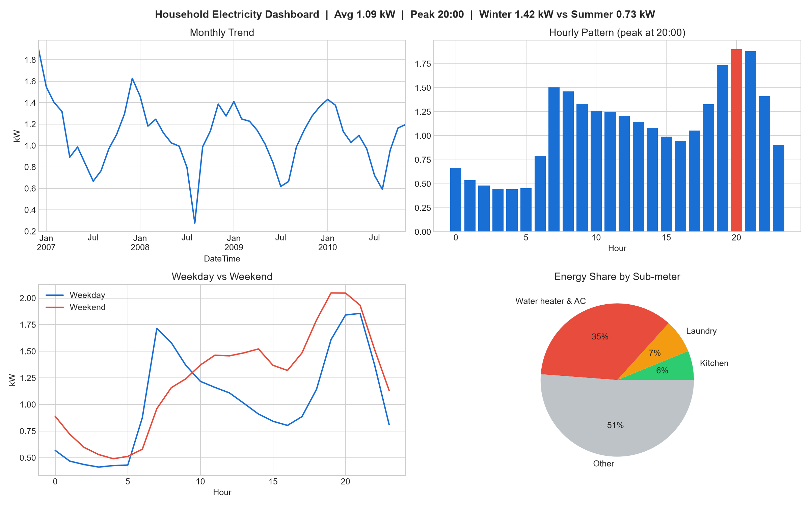
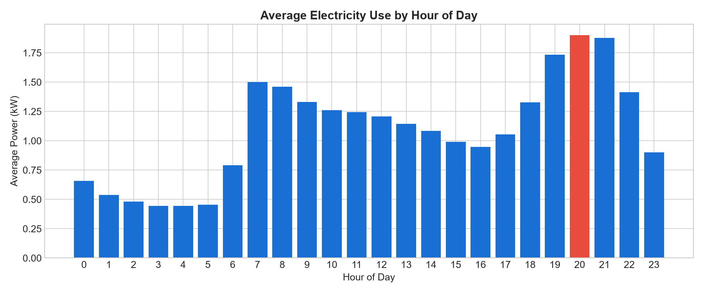
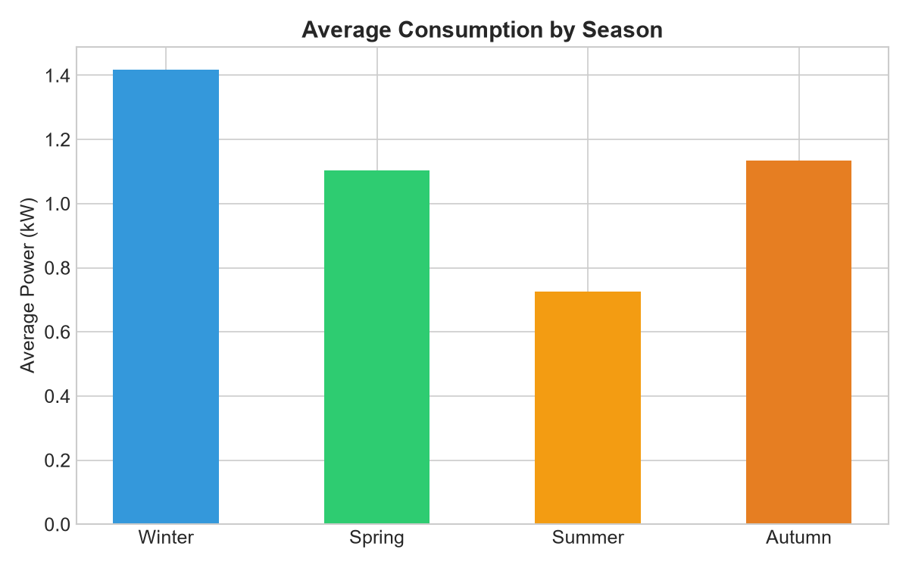
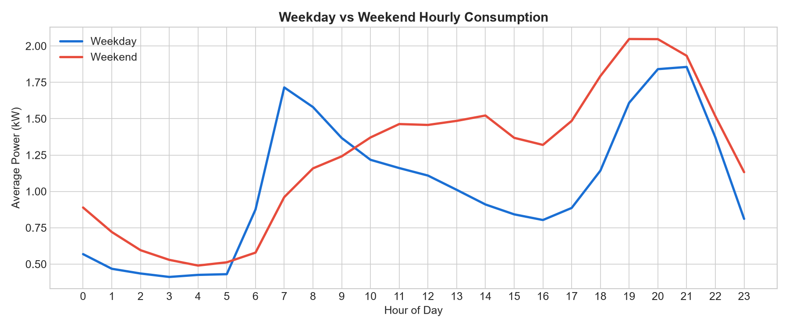
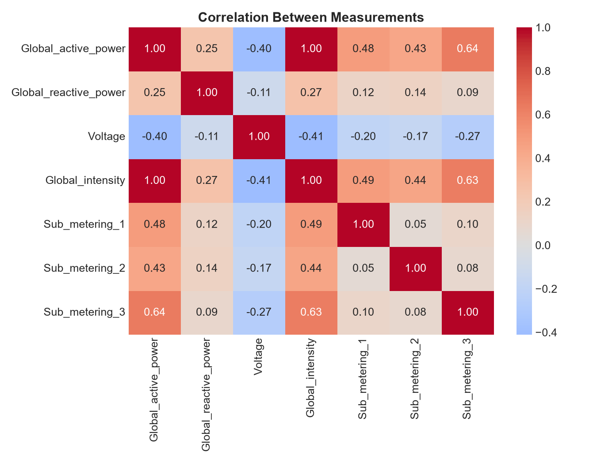
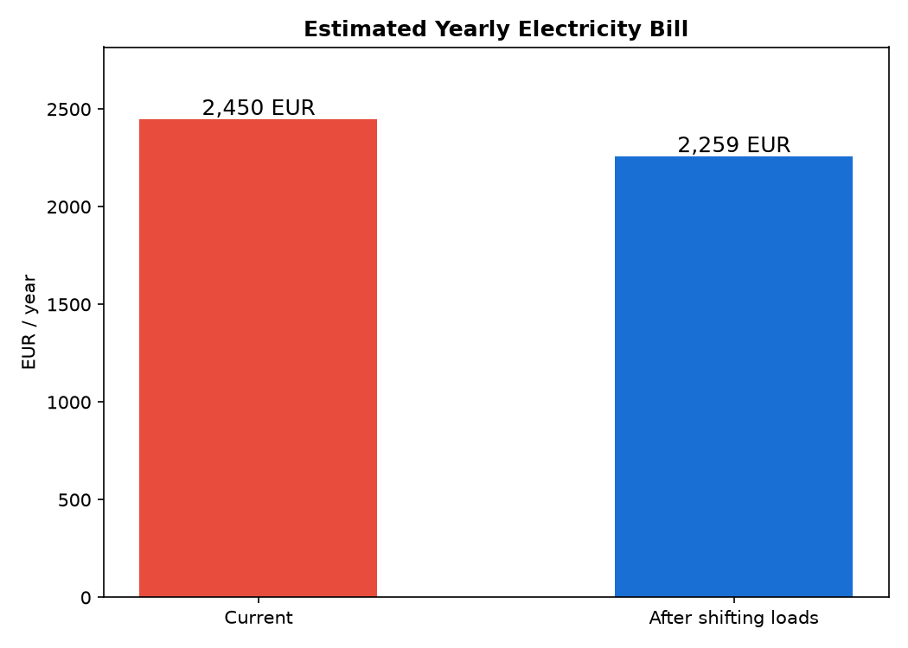
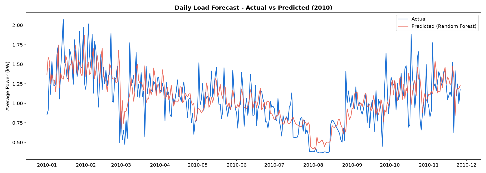
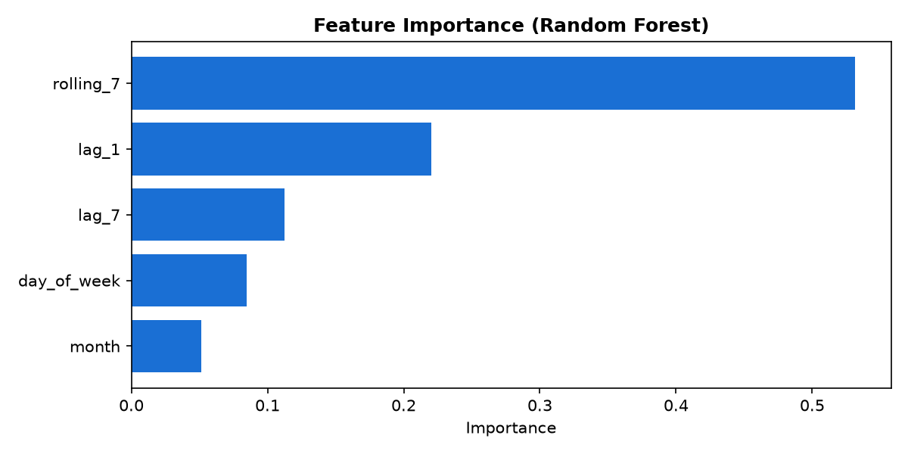

# Electrical Load Forecasting & EDA Dashboard

Analysis of ~4 years of minute-level electricity data from a household near Paris: when and why power is used, what it costs, and how well daily load can be forecast. Includes an interactive Streamlit dashboard.

**Dataset:** [UCI Individual Household Electric Power Consumption](https://archive.ics.uci.edu/dataset/235/individual+household+electric+power+consumption) (2,075,259 rows, Dec 2006 – Nov 2010)
**Tools:** Python, Pandas, NumPy, Matplotlib, Seaborn, Scikit-learn, Streamlit



## Project structure

```
├── 01_data_cleaning.py    # download data, handle missing values, add time features
├── 02_eda.py              # summary stats, 6 charts, dashboard image
├── 03_cost_analysis.py    # yearly bill + savings from shifting loads to off-peak
├── 04_forecasting.py      # Baseline vs Linear Regression vs Random Forest
├── app.py                 # interactive Streamlit dashboard
├── utils.py               # shared helper functions
├── images/                # saved charts
└── requirements.txt
```

## How to run

```
pip install -r requirements.txt
python 01_data_cleaning.py
python 02_eda.py
python 03_cost_analysis.py
python 04_forecasting.py
streamlit run app.py
```

The dataset downloads automatically the first time (~20 MB).

## 1. Data cleaning

- 25,979 rows (1.25%) had missing values, with all columns blank at the same time, meaning the meter didn't record anything in those minutes. These rows were dropped → **2,049,280 rows** left.
- Added features: `Year`, `Month`, `Hour`, `DayOfWeek`, `DayType` (weekday/weekend), `Season`.

## 2. Key findings

| Finding | Result |
|---|---|
| Peak demand hour | **8 PM** (1.90 kW avg), about 4x the night-time load (0.47 kW) |
| Winter vs Summer | **1.42 kW vs 0.73 kW**, winter uses ~2x more |
| Weekday vs Weekend | Weekends use ~19% more (1.23 vs 1.04 kW); weekdays have a sharp 7 AM peak |
| Biggest metered load | Water heater & AC = **~35% of total energy** |
| Yearly trend | Stable at ~1.06–1.12 kW from 2007–2010 (2006 only has 2 weeks of December data) |

| Hourly pattern | Seasonal |
|---|---|
|  |  |
| **Weekday vs Weekend** | **Correlation** |
|  |  |

## 3. Cost analysis

Using a peak / off-peak tariff (approx. French EDF rates: 0.27 €/kWh from 6 AM–10 PM, 0.21 €/kWh from 10 PM–6 AM):

- The household uses **~9,500 kWh/year**, with an estimated bill of **~€2,450/year**
- Only **20%** of energy is used in cheaper off-peak hours
- Moving the water heater to a night timer and running kitchen/laundry appliances after 10 PM could save **~€190/year (~8% of the bill)**



## 4. Forecasting

Predicting next day's average load from yesterday's load, last week's load, 7-day rolling average, day of week and month.
Time-based split: trained on 2007–2009, tested on 2010 (330 days).

| Model | MAE (kW) | RMSE (kW) | MAPE |
|---|---|---|---|
| Baseline (same day last week) | 0.259 | 0.347 | 27.6% |
| Linear Regression | 0.183 | 0.253 | 19.7% |
| **Random Forest** | **0.181** | **0.248** | **19.5%** |

Random Forest performed best, reducing error by **~30%** compared to the baseline. The 7-day rolling average and yesterday's load were the most useful features.





## 5. Recommendations

1. **Put the water heater on a night timer**: it's the biggest metered load (~35%), and heating water off-peak gives most of the savings.
2. **Run dishwasher / washing machine / dryer after 10 PM**: avoids the 7–9 PM peak.
3. **Use a smart thermostat**: winter consumption is almost double summer, so scheduling heating around when people are home targets the biggest seasonal cost.

## 6. Streamlit dashboard

`streamlit run app.py` opens an interactive dashboard with filters for year, season and weekday/weekend, KPI cards, hourly/seasonal charts, energy share by sub-meter and the forecast results.

## Limitations

- Data is from a single household.
- No temperature data, so the winter increase can't be directly linked to weather.
- Tariff prices are approximate and used only for estimates.
